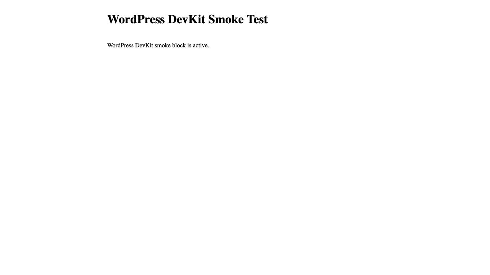
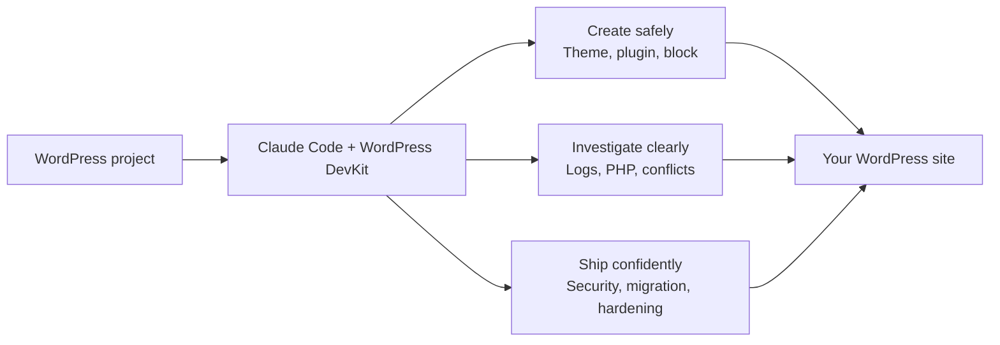

# WordPress DevKit for Claude Code

Build, diagnose, and ship WordPress work with fewer guessy shortcuts.

WordPress DevKit gives Claude Code focused workflows for the moments that normally cost the most time: starting a safe plugin or block theme, untangling a white screen, reviewing PHP before release, building Gutenberg blocks, and preparing a migration without damaging serialized data.

It is designed for developers and agencies working on real WordPress sites. It does not connect to your hosting account, database, or analytics service. It works in the project folder you open with Claude Code and asks before anything that could alter a live site.



## Why install it

- Start with WordPress-shaped code, not a generic PHP scaffold. The theme, plugin, and block workflows use WordPress conventions from the first file.
- Diagnose failures calmly. The debugging workflow moves from the error log to a likely root cause and a safe confirmation step.
- Catch the security mistakes that matter before release: unsafe output, request data, nonces, SQL, capabilities, and direct-file access.
- Make database migrations less risky. The migration workflow always puts backup and dry-run steps ahead of a real replacement and protects `guid` values.
- Keep routine maintenance intentional. Cache flushing and hardening checks are explicit commands, with practical warnings for production use.



## Install

This is a **Claude Code** plugin. It is not a generic uploadable extension for the Claude desktop chat app. Anthropic supports a ZIP as a temporary Claude Code session load, while a GitHub marketplace is the right path for an install that stays available and receives updates. See Anthropic’s [plugin guide](https://code.claude.com/docs/en/plugins) and [marketplace guide](https://code.claude.com/docs/en/plugin-marketplaces).

### Recommended: install from GitHub

Start Claude Code in any project and run:

```text
/plugin marketplace add mohitkale/wordpress-devkit
/plugin install wordpress-devkit@wordpress-devkit-marketplace
/reload-plugins
```

You need a current Claude Code version with the `/plugin` command. Claude Code runs on macOS and Windows. On Windows, Git Bash or WSL is usually the smoothest environment for WordPress CLI work; Docker Desktop works from either when its integration is enabled.

### Try a downloaded ZIP for one session

Download the release artifact built by `scripts/package-plugin.sh`, then launch Claude Code with the archive. ZIP session loading requires Claude Code 2.1.128 or later.

macOS / Linux:

```bash
claude --plugin-dir "$HOME/Downloads/wordpress-devkit-1.1.0.zip"
```

Windows PowerShell:

```powershell
claude --plugin-dir "$HOME\Downloads\wordpress-devkit-1.1.0.zip"
```

Windows Git Bash:

```bash
claude --plugin-dir "$HOME/Downloads/wordpress-devkit-1.1.0.zip"
```

The ZIP is not uploaded to Claude.ai; it is read locally by the Claude Code process for that session. For a persistent install, use the marketplace steps above.

### Develop from this checkout

```bash
git clone https://github.com/mohitkale/wordpress-devkit.git
cd wordpress-devkit
claude --plugin-dir .
```

Run `/help` to confirm the namespaced commands are available.

## What you can ask for

Use plain language, or call a workflow directly.

| Situation | Ask Claude | Direct workflow |
| --- | --- | --- |
| Start a block theme | “Create a block theme named acme-studio in this WordPress install.” | `/wordpress-devkit:theme-init acme-studio` |
| Start a plugin | “Scaffold a secure plugin named acme-forms.” | `/wordpress-devkit:plugin-scaffold acme-forms` |
| Recover a broken site | “The site returns 500 after a plugin update. Investigate it.” | `/wordpress-devkit:wp-debug site returns 500 after plugin update` |
| Review release risk | “Audit this plugin for WordPress security issues.” | `/wordpress-devkit:security-audit ./wp-content/plugins/acme-forms` |
| Add a block | “Create a dynamic latest-posts block.” | `/wordpress-devkit:gutenberg-block latest-post dynamic` |
| Move a site safely | “Plan a staging-to-production URL migration.” | `/wordpress-devkit:db-migration https://staging.example.com https://example.com` |
| Check the environment | “Is this WordPress project ready for maintenance?” | `/wordpress-devkit:doctor` |
| Clear only the common caches | “Flush the WordPress caches after this deploy.” | `/wordpress-devkit:flush` |
| Make a release-readiness pass | “Run the WordPress hardening check.” | `/wordpress-devkit:hardening-check` |

For a multi-version WordPress or PHP upgrade, ask Claude to create an upgrade plan. The specialist checks the current site state, builds a compatibility matrix, and includes a staging-first rollback plan instead of guessing version compatibility.

## What stays safe by default

- Security and hardening reviews are read-only. They report evidence and fixes; they do not rewrite your code.
- Migration guidance generates a reviewed plan first. It never runs a database migration for you.
- Debugging keeps errors out of a production visitor’s screen and avoids printing database credentials or WordPress salts.
- Cache flushing warns when a production cache rebuild may add load.
- The session hook only detects local WordPress markers and adds a short in-session hint. It does not send data to a service operated by this project. Details: [PRIVACY.md](PRIVACY.md).

## Tested WordPress flow

The repository includes a lightweight Docker Desktop smoke test. It launches WordPress 6.8.3, PHP 8.3, WP-CLI 2.11, and MariaDB 11.4, then:

1. Activates a fixture plugin with a WordPress block registration.
2. Activates a fixture block theme.
3. Renders the dynamic block on a real WordPress front page, shown in the screenshot above.
4. Runs the safe cache commands.
5. Runs a URL `search-replace` dry run and confirms the stored value did not change.

Run it with Docker Desktop running:

```bash
tests/docker/smoke.sh
```

The suite removes only its own `wordpress-devkit-smoke` containers, network, and volume when it finishes. Use `KEEP_STACK=1 tests/docker/smoke.sh` if you want the temporary test site to remain available at `http://localhost:8088` for inspection.

## Release checks

```bash
node tests/run.js
claude plugin validate .
scripts/package-plugin.sh
```

The package command creates `dist/wordpress-devkit-<version>.zip` with the plugin root at the archive root, ready for a local ZIP-session test.

## Support and privacy

Please use [GitHub Issues](https://github.com/mohitkale/wordpress-devkit/issues) for support and bug reports. The optional email field has deliberately been omitted from public plugin metadata: an email in `plugin.json` is visible to everyone who can view the repository and is more likely to attract spam than provide a useful installation benefit.

This project is MIT-licensed. See [LICENSE](LICENSE).
